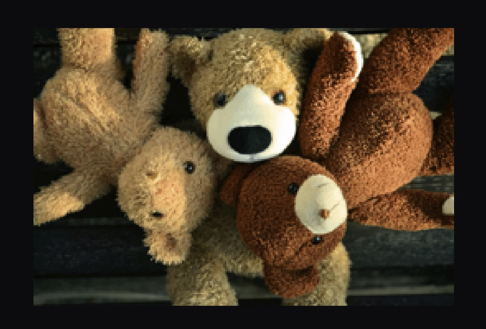
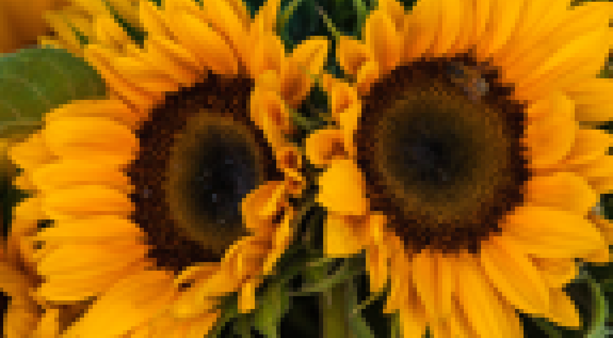

# Enhance AI
Enhance AI is an interactive super-resolution platform that allows you to run, compare and evaluate image upscaling models locally, in real time.

It combines a cross-platform Flutter application with a fully reproducible deep learning pipeline, designed to explore the trade-offs between model quality, latency and deployment constraints.

All models in this project are designed, implemented and trained from scratch, and executed on-device using ONNX Runtime.


*Real-time comparison of super-resolution models*

## Why this project matters

Super-resolution research often focuses on benchmark performance, but real-world deployment introduces constraints:

* Limited compute (especially on mobile)
* Latency requirements
* Model size vs quality trade-offs

Enhance AI bridges that gap by making models directly testable in a real user environment, not just offline experiments.

## Features

### User-facing
* Run super-resolution models locally (no backend)
* Compare outputs with an interactive before/after slider
* Zoom and inspect pixel-level differences
* Pin and compare multiple results side-by-side
* Export generated images

### Technical highlights

* Cross-platform app (Flutter: mobile, desktop)
* ONNX Runtime for efficient on-device inference
* Modular architecture for rapid experimentation
* Fully reproducible training + evaluation pipeline


## Project Structure

```
├── app/          # Flutter application (UI + inference integration)
├── models/       # Trained models (.keras + ONNX)
├── results/      # Evaluation results (CSV + plots)
└── src/
    ├── architectures/   # model definitions (CNNU, ESPCN, SRRN, SRGAN...)
    ├── notebooks/       # training experiments
    ├── image_processing.py  # preprocessing utilities
    ├── train_model.py       # configurable training script
    ├── tf_to_onnx.py        # model export to ONNX
    └── validator.py         # evaluation and benchmarking
```

## Models

| Model                          | Description                             | When to use                 |
| ------------------------------ | --------------------------------------- | --------------------------- |
| **Average**                    | Basic interpolation baseline            | Reference / sanity check    |
| **CNNU** | Lightweight convolutional model         | Fast inference on mobile    |
| **ESPCN**                      | Efficient sub-pixel convolution network | Best speed/quality balance  |
| **SRRN**    | Deeper residual architecture            | Higher quality, slower      |
| **SRGAN** *(experimental)*     | GAN-based perceptual model              | Visual realism over metrics |

## Model Design

All models in this project are implemented from scratch using TensorFlow/Keras, with no pre-trained weights or external architectures.

The goal is not only to achieve good performance, but to understand how architectural decisions impact:

- reconstruction quality
- perceptual realism
- inference cost
- deployability on constrained devices

The design variations explore trade-offs such as residual depth, upsampling strategies (e.g. PixelShuffle), and adversarial training.

This makes the project both a practical tool and a research playground.

## Results & Trade-offs

Evaluation performed on DIV2K validation set using an NVIDIA RTX 5070 Ti.

Metrics:

* MAE (Mean Absolute Error) → pixel accuracy
* Perceptual Loss → visual similarity
* Runtime (seconds) → deployment cost

| Model   | MAE    | Perceptual Loss | Runtime (s) |
| ------- | ------ | --------------- | ----------- |
| Average | 0.0343 | 0.5438          | 0.0105      |
| CNNU    | 0.0303 | 0.5153          | 0.0161      |
| ESPCN   | 0.0319 | 0.5286          | 0.0147      |
| SRRN    | 0.0317 | 0.5337          | 0.0691      |
| SRGAN   | 0.0321 | 0.5285          | 0.0694      |

### Key insights

* Lightweight CNNs already outperform interpolation significantly
* ESPCN offers the best practical trade-off for real-time use
* Deeper models (SRRN) improve quality but introduce latency

## Visual Comparison

| Input                 | Average             | CNNU                 |
| --------------------- | ------------------- | -------------------- |
|  |  |  |

| Input                 | ESPCN                 | SRRN                 |
| --------------------- | --------------------- | -------------------- |
|  |  |  |

*All outputs correspond to the same crop for fair comparison*

## Training Pipeline

The project includes a complete training pipeline, designed to make experimentation easy.

At a high level:

1. Images are loaded and preprocessed (HR --> LR/HR pairs)
2. Models are defined in a modular way (`architectures/`)
3. Training is done with TensorFlow/Keras
4. Results are evaluated using `validator.py`
5. Models are exported to ONNX and executed locally through ONNX Runtime

You can either:
- use the provided scripts (`train_model.py`)
- work directly from the notebooks in `src/notebooks/`
- retrain existing models, tweak architectures (filters, blocks, etc.)   

### Training details
- Dataset: DIV2K (train/validation split)
- Upscale factors: x2/x4
- Optimizer: Adam
- Learning rate: 1e-4
- Epochs: 200
- Loss functions:
    - L1 (MAE)
    - Perceptual loss (VGG-based)

## Application

The Flutter application provides a clean and responsive interface to interact with the models in real time.

You can:

- Upload an image
- Select a model and upscale factor
- Compare results using an interactive before/after slider
- Zoom and inspect pixel-level details
- Pin results for side-by-side comparison
- Download generated images


## Setup

### 1. Clone the repository

```
git clone <repo_url>
cd enhance-ai
```

### 2. Install dependencies

```
pip install -r requirements.txt
```

### 3. Run the app (windows)

```
cd app
flutter pub get
flutter run -d windows
```
## Limitations
- Not optimized for very high-resolution images (>4K)
- SRGAN can produce artifacts in low-light images
- Minor precision differences after ONNX export

## Future work

- Quantization and model compression
- GPU / NNAPI / Metal acceleration
- Video super-resolution

## Acknowledgements

- DIV2K dataset for super-resolution benchmarking
